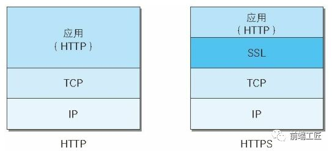
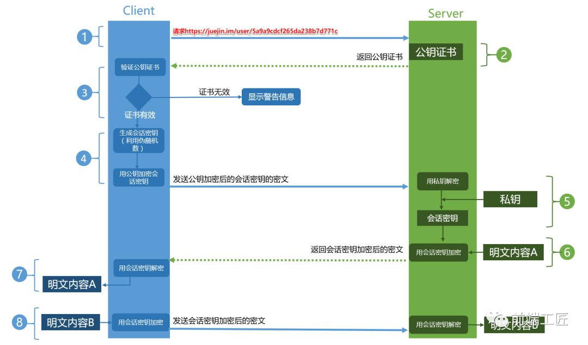

### HTTPS = HTTP + SSL/TSL
#### HTTP存在以下三种问题
- 通信使用明文（不加密），内容可能被窃听
- 无法证明报文的完整性，可能遭篡改
- 不验证通信方的身份，因此可能遭遇伪装
  
### SSL
SSL(Secure Sockets Layer  安全套接层)及其继任者TSL(Transport Layer Security 传输层安全)是为网络通信提供安全和数据完整性的一种安全协议。二者均在传输层对网络连接进行加密。  

##### HTTPS的安全性几乎都是SSL的作用

### HTTPS的安全机制
- 防窃听：传输的内容采用非对称加密+对称加密
  1) 非对称加密用于client和server之间安全地传输“对称加密的密钥” 是由client使用伪随机算法生成的
  2) client/server通过“对称加密的密钥”对传输的内容进行加密和解密，实现安全传输
- 保证完整性不被篡改：使用数字签名  
  1) 发送的一方先用Hash函数（不可逆）对原文生成一个消息摘要，然后对摘要用发送者的私钥生成一个签名。和原文一起传输。
  2) 接收的一方用发送者的公钥对签名解密获得一个摘要，对原文内容用Hash函数也获得一个摘要，对比两个摘要从而判断完整性。
- 以上的过程中通信双方都需要事先知道发送方的公钥，而且是在安全的前提下，因此需要证书颁发机构(Certificate Authority 简称CA)。  
  1) 服务器的运营人员向CA申请证书，然后存放于服务器
  2) client向server发送请求时，server会返回证书文件
  3) client验证好证书文件后，从中获取server的公钥
  4) client使用伪随机数生成器生成“对称密钥”，用3)获得公钥加密后发送server，server通过私钥解密获取。
  5) client和server之后的数据传输都采用“对称加密”方式用该“对称密钥”加密传输/接收解密

### HTTPS工作流程
