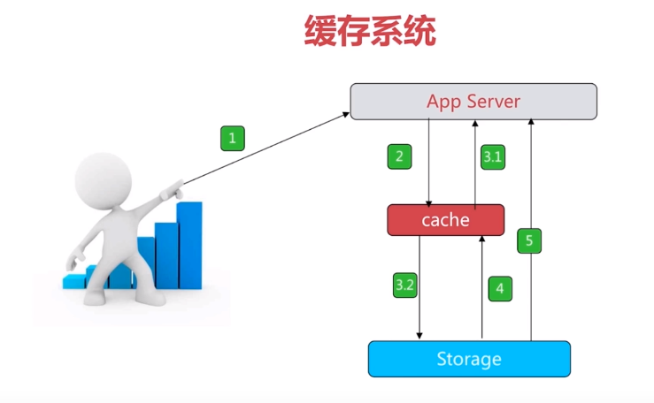

总体特征
===
- 高性能的键值存储服务
- 多种数据结构
- 丰富的功能
- 高可用、分布式支持
- 开源
  
特性总览
===
- 速度快  
  1）存储于内存中  
  2）使用C语言编写  
  3）单线程 
- 持久化
- 多种数据结构
- 功能丰富
- 简单

应用场景
---
- 可作为缓存系统（不能说他是缓存）  
    
- 计数器    
  1）微博、视频网站的点赞计数  
- 消息队列系统  
- 排行榜    
  1）(使用有序集合)
- 社交网络    
  1）粉丝数、关注数
- 实时系统  
  1）垃圾邮件处理系统等（使用bitmap）

启动方法
---
- 验证是否启动  
    1）`ps -ef | grep redis`  
    2）`net -antpl | grep redis`  
    3）`redis-cli -h host -p port ping`  
- 最简启动：`redis-server`  
- 动态参数启动：`redis-server --port 6380`  
- 配置文件启动：`redis-server config` 如 `redis-server /etc/redis.conf` 

常用配置项
---
- daemonize：是否是守护进程
- port：redis对外端口
- logfile：redis系统日志
- dir：redis工作目录

通用命令
---
- KEYS [patten]：枚举key    O(n)  
- DBSIZE：返回当前数据库key的数量   O(1)
- EXISTS KEY：KEY是否存在   O(1)
- DEL KEY：删除KEY  O(1)
- EXPIRE KEY SECONDS：给KEY设置过期时间 O(1)
- TYPE KEY：KEY的类型   O(1)
  
单线程为什么这么快
---
- 纯内存（主要原因）
- 非阻塞IO
- 避免线程切换和竞态消耗  
  
一次只运行一条命令，所有命令都像是在一条单向公路上排队

一对键值对占用空间 <=100k 较好

list
---
- LPUSH/RPUSH KEY VALUE
- LPOP/RPOP KEY
- LINSERT KEY before/after value newValue在值value前/后插入newValue
- LREM KEY count VALUE删除队列中值为value的元素
- LTRIM KEY start end删除从start到end的部分，下标从0开始
- LRANGE KEY start end  时间复杂度O(n)
- LLEN KEY 时间复杂度O(1)
- LSET KEY index value将下标index的元素值设为value
- 应用：  
  1)LPUSH + LPOP = 栈  
  2)LPUSH + RPOP = 队列  
  3)LPUSH + LTRIM = 指定数量的队列    
  4)LPUSH + BRPOP = 消息队列

set
---
特性：无序，无重复  
可计算集合之间的交集、差集、并集  
主要命令：  
- smembers：枚举全部元素
- srandmember/spop：随机返回一个元素/随机返回并移除一个元素
- tag：给key打上标签
- sadd + sinter = 社交相关的（比如共同关注）  
  
有序集合
---
特性：有序，无重复  
主要命令：  
- zadd key score element(可以是多对，时间复杂度O(logN))
- zrem key element  删除key，O(1)
- zscore key element    返回key中element的score时间复杂度O(1)
- zincrby key increScore element    将key中element的分值+increScore
- zcard/scard key 返回总个数
- zrangebyscore key 范围 数量   返回key中分数在该范围的该数量的成员
- zcount key min max 返回key中分数在min~max的成员
- zremrangebyrank key start end 移除指定排名区间内的所有成员
- zremrangebyscore key min max 移除指定分数区间内的所有成员

有序集合的命令应该是最多的，很多和集合相似

持久化
===
**通用配置**  
1）logfile ""  redis的运行日志，这里可写入例如"/var/log/redis/redis.log"  
2）dir path 数据备份（on disk）的存放路径，这里的path可写入例如/usr/local/redis_backup，*该路径很重要* ，因为在redis在重启时将会读取该路径下的数据备份进行数据恢复

RDB
---
- dir路径下生成.rdb文件，他是一个二进制文件，  
  是一个redis里数据的快照，具体文件名可配置，也可配置让其压缩
- 该备份是系统默认的
- 手动备份命令  
  1）save   由redis主进程执行，将会阻塞当前的其他redis操作  
  2）bgsave     由redis主进程fork子进程在background进行save操作，阻塞只会发生在父进程fork时
- 自动备份  
  1）默认三条save条件，满足其一就会触发bgsave命令  
  2）可只使用一条  
  3）如果将三条命令都注释，将会永不自动触发备份（关闭）  

**优点**  
1）该文件体积较小，一般是压缩的  
2）从该备份数据恢复到redis的速度非常快    
**缺点**  
由于自动触发的条件限制，几乎不可避免的会丢失数据，即数据的完整性差  
**数据恢复（有.rdb文件，即开启了该备份方式）**  
将.rdb文件恢复到redis。  
注：如果将redis服务shutdown，则会立即更新.rdb文件

AOF
---
- dir路径下生成.aof文件，该文件可读性较强，  
  是一种日志，用来记录存储某一数据时的redis命令
- 该备份方式系统默认是关闭的
- 相比于RDB的三种备份命令，AOF只有一种备份命令但有三种备份方式  
  1）always 每一次redis的数据更新命令都要写入.aof文件  
  2）everysec   每秒写一次，将之前新的数据更新命令写入文件
  3）no 不设置，由系统决定，通常每30秒写一次
- bgrewriteaof两个相关配置：一个是文件大小，一个是当前文件相对于上一次rewrite时文件大小的增长率  
**优点**  
1）数据完整性好  
2）每次的备份时间短，操作轻  
**缺点**  
1）文件占用空间大，恢复时间慢  
*优化：*bgrewriteaof：读取redis的数据，依此重新写一份.aof文件，去掉冗余  
**数据恢复（有.aof文件，即开启了该备份方式）**  
1）无论有没有开启RDB备份方式，数据都只会从.aof中去恢复，如果没有.aof文件，那就没得恢复了  
2）如果开启了RDB备份方式，则.rdb文件的更新和.aof的更新互不干扰  

混合持久化
---
**该备份方式需要redis版本4.0+**  
配置项：aof-use-rdb-preamble
系统默认是关闭的  
该方式开启后，将会在执行bgrewriteaof时影响.aof文件  
.aof文件在每次执行bgrewriteaof时都将会存储RDB格式的数据，相当于生成了一次快照，不是追加上去，而是像RDB方式那样，整个文件被替换成新的  
在此之后的变更的数据将会以aof的格式追加到.aof文件

**优点**  
结合了RDB和AOF的优点：既保证了数据的完整性又保证了再恢复数据时的速度  
**数据恢复**  
1）可不开启该配置项，.aof仍可恢复，先恢复RDB格式的数据，再恢复AOF格式的数据
2）如果开启RDB，则两者的文件生成互不干扰，但只从.aof中恢复